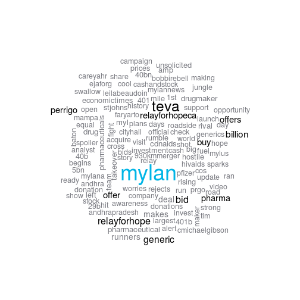
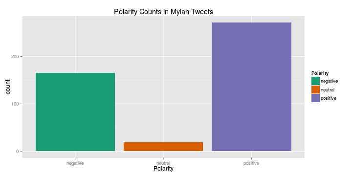
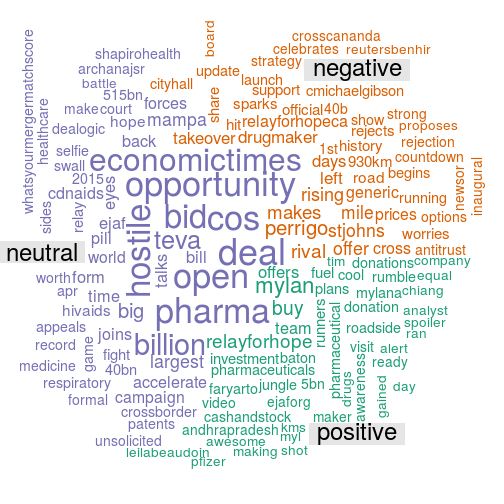
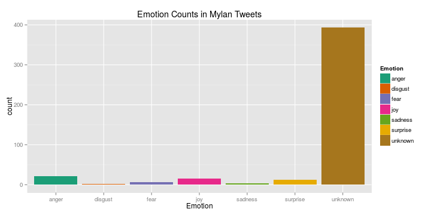
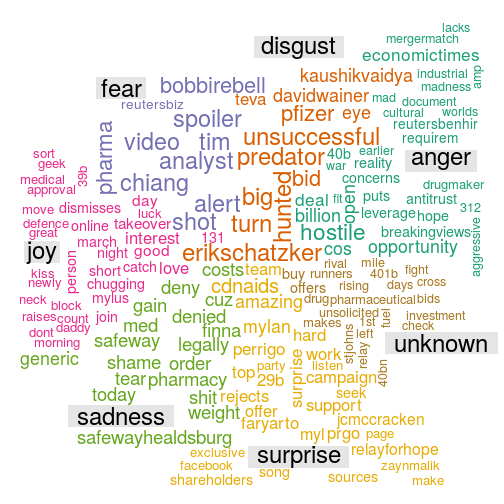

# Overview
In this document, we are going to perform sentiment analysis on tweets
about Mylan Cable. The tweets were pulled on April 24, 2015, in the midst
of a series of bids and hostile takeover attempts between Mylan, Teva, and
Perrigo.

We're going to need several packages to interact with the Twitter REST
APIs, perform the sentiment analysis, and visualize the tweets.

```r
library(sentiment)
library(twitteR)
library(ggplot2)
library(wordcloud)
library(ggmap)
library(RColorBrewer)
```

# Pulling the Tweets
## Authorizing the Request
To get the Twitter data, we need to have a developer account set up
with Twitter.  The `twitteR` package accesses the API using the
credentials provided by Twitter.


```r
consumer.key <- '**********'
consumer.secret <- '**********'
access.token <- '**********'
access.secret <- '**********'
setup_twitter_oauth(consumer.key, consumer.secret,
                    access.token, access.secret)
```

## Searching
Once we authorize our account, we can search recent and popular
tweets using a search string, language, location, and several other
parameters. 

We'll search recent tweets for the word Twitter and transform it into 
a data frame for easier manipulation.


```r
mylan.tweets <- searchTwitter(searchString = "#mylan", n = 1500,
                                lang = "en")
mylan.df <- data.frame(t(sapply(mylan.tweets, as.data.frame)))
```


From here, we need to clean and process our data for sentiment analysis.


```r
mylan.text <- unlist(mylan.df$text)
```
## Cleaning the Data
First, we  clean the data by
converting the encoding to UTF-8 and removing any non-text characters
(links, special characters, etc.).


```r
mylan.clean <- sapply(mylan.text, iconv, to='UTF-8', sub='byte', USE.NAMES = FALSE)
mylan.clean <- sapply(mylan.clean, function(i) gsub("<.{2}>", "", i),
                      USE.NAMES = FALSE)
mylan.clean <- sapply(mylan.clean, function(i) gsub("'s\\b", "", i),
                      USE.NAMES = FALSE)
mylan.clean <- sapply(mylan.clean, function(i) gsub("\\bhttps*://.+\\b", "", i), USE.NAMES = FALSE)
mylan.clean <- sapply(mylan.clean, tolower, USE.NAMES = FALSE)
mylan.clean <- sapply(mylan.clean, function(i)
    gsub("([mylan|teva|perrigo])[[:punct:]]'*s\\b", "\\1", i),
                      USE.NAMES = FALSE)
mylan.clean <- sapply(mylan.clean, function(i) gsub("\\n", " ", i), USE.NAMES = FALSE)
mylan.clean <- sapply(mylan.clean, removePunctuation,
                      USE.NAMES = FALSE)
```

Finally, since we are interested in the sentiment, we remove function
words (preposition, conjunctions, etc.) so we can focus on the content words.


```r
mylan.clean <- sapply(mylan.clean, function(i) removeWords(i, stopwords("SMART")),
                    USE.NAMES = FALSE)
```

# Visualizing the Tweets
Now that we have a clean data set, we can create a corpus of the words
and try to visualize the topics being discussed. For this, we turn to
a word cloud. The most frequently used words are plotted in a field,
and we color and scale them by how frequent they are.


```r
mylan.corpus <- Corpus(VectorSource(mylan.clean))
color.vec <- rev(brewer.pal(8, "Set2"))[-1]
color.vec <- rev(c("#00B5E6", "#FFD92F", rep("#000000", 8), "#787980"))
wordcloud(mylan.corpus, scale = c(3, 1), min.freq = 4, color = color.vec,
          max.words = 120)
```



The terms dominating the word cloud are centered around the bidding
war: "Mylan," "Teva," "Perrigo," "bid," "offer," etc.  We also see
words that would be used to describe these companies like
"generic/generics" and  "drug/drugmaker."

The next largest group of related terms is referring to the Mylan
Relay for Hope, which kicked off the same day we pulled the tweets.


# Sentiment Analysis
Now that we've seen the common words in tweets containing "Mylan," we
can do some basic sentiment analysis. It should be noted that this
should be done with a grain of salt when we use Twitter data, since
each tweet is a rather small sample of words.

Adding to the difficulty is the nature of the news -- tweets about the
bidding wars are likely to have been written by financial reporters or
analysts and lacking in emotional content.

Additionally, the topics at hand may add extra difficulties for
prediction. For example, a tweet reporting on a hostile takeover might get
classified as expressing negative or strong emotions because of the word
"hostile." 

## Polarity
Our first step will be to try and identify the polarity of the
tweets.  The `sentiment` package in `R` uses a naive Bayes classify to
predict the likelihood of a text being positive, negative or neutral.
A tweet will then be classified according to which one has the highest
likelihood. 


```r
mylan.polar <- classify_polarity(mylan.clean)[,4]
mylan.polar[is.na(mylan.polar)] <- "unknown"
mylan.df <- data.frame(mylan.df,
                      Polarity = mylan.polar)
ggplot(mylan.df, aes(x = Polarity)) + geom_bar(aes(y=..count.., fill=Polarity)) +
        scale_fill_brewer(palette="Dark2") +
        ggtitle("Polarity Counts in Mylan Tweets")
```

 

Most of the tweets are expressing a positive sentiment, and we see
very few neutral cases. Given the nature of the data, we'll want to
take a closer look and see what words are associated with each class.


```r
l.polar <- levels(mylan.df$Polarity)
n.polar <- length(l.polar)
by.polar <- sapply(l.polar, function(polar)
   paste(mylan.clean[mylan.polar == polar], collapse = " ")
)
by.polar.corpus <- Corpus(VectorSource(by.polar))
polar.doc.mat <- as.matrix(TermDocumentMatrix(by.polar.corpus))
colnames(polar.doc.mat) <- l.polar

comparison.cloud(polar.doc.mat, colors = brewer.pal(3, "Dark2")[c(2,3,1)],
  random.order = FALSE, scale = c(3, 1), title.size = 2,
                 max.words = 150)
```



In the positive cases, it looks like most people are talking about the
Relay for Hope, but we do see some tweets about the bidding wars.


```r
head(mylan.text[mylan.df$Polarity == "positive" &
                    !grepl("^RT", mylan.text)], 5)[-3]
```

```
## [1] "TEVA Pharma wants to swallow Mylan…a generic rumble in the jungle! http://t.co/o4HtlJIoFg #pharma #healthcare #TEVA #Mylan"
## [2] "TEVA Pharma wants to swallow Mylan…a generic rumble in the jungle! http://t.co/0W2xVnDtut #pharma #healthcare #TEVA #Mylan"
## [3] "Teva on top of Mylan, Mylan on top of Perrigo... Anyone else wanna join the Party here? #Mylan https://t.co/nKhGJSIhkA"    
## [4] "#Teva #Pharmaceuticals Offers to Buy #Mylan for $40B http://t.co/091RH5D0Pa"
```

On the negative side, it looks like news about Perrigo rejecting
Mylan's bid is dominating the tweets.


```r
head(mylan.text[mylan.df$Polarity == "negative"], 5)[-3]
```

```
## [1] "#Reuters #Generic drugmaker #Mylan goes hostile in bid for Perrigo http://t.co/8G0o5RIVGf"                        
## [2] "#Mylan Makes Hostile $31.2 Billion #Perrigo Bid to Thwart #Teva http://t.co/VeCMkthgYA #Pharma #M&amp;A"          
## [3] "#Mylan makes official bid for Perrigo in generic drug contest - http://t.co/oaX8VEI3KD"                           
## [4] "RT @followthemoney: Updated: #Perrigo rejects #Mylan's latest bid of $31 billion http://t.co/XmrPlIPxFH @TribLIVE"
```

It looks like the neutral cases are mostly hard news.


```r
head(mylan.text[mylan.df$Polarity == "neutral" &
                    !grepl("^RT", mylan.text)], 5)
```

```
## [1] "#Mylan to Make Formal Bid for #Perrigo Worth About $33 Billion - #whatsyourmergermatchscore"                                                    
## [2] "#Teva’s hostile bid for #Mylan: Deal could open up a $2 billion opportunity for pharma Cos http://t.co/wggd7lJr1o http://t.co/qweINLMxBY"       
## [3] "Teva Offers to Buy #Mylan in $40.1B Cash and Stock Deal: http://t.co/9ABvqoK3jj"                                                                
## [4] "Via @Dealogic: #Teva's $51.5bn bid for #Mylan on 21 Apr 2015 is the largest cross-border #Healthcare M&amp;A deal on record $MYL $TEVA #mergers"
## [5] "Big Pharma M&amp;A talks is back again! This time #Teva eyes #Mylan in a $40bn unsolicited bid."
```

## Emotions
Now we can break down the polarity and take a look at the emotional
landscape. We should be even more cautious here, as we're predicting
one of six emotions based on just 140 characters.


```r
mylan.emo <- classify_emotion(mylan.clean)[,7]
mylan.emo[is.na(mylan.emo)] <- "unknown"
mylan.df <- data.frame(mylan.df, Emotion = mylan.emo)
```

The algorithm assigns the likelihood of every one of the above
emotions being expressed, and classification is based on which emotion
has the highest likelihood.  We can examine how the classifications
broke down.


```r
ggplot(mylan.df, aes(x = Emotion)) + geom_bar(aes(y=..count.., fill=Emotion)) +
        scale_fill_brewer(palette="Dark2") +
        ggtitle("Emotion Counts in Mylan Tweets")
```

 

Given the brevity of tweets, it's no surprise that the largest
category, by far, is "unknown."  These represent cases where the
algorithm could not distinguish between the possibilities.


```r
l.emo <- levels(mylan.df$Emotion)
n.emo <- length(l.emo)
by.emo <- sapply(l.emo, function(emo)
   paste(mylan.clean[mylan.emo == emo], collapse = " ")
)
by.emo.corpus <- Corpus(VectorSource(by.emo))
emo.doc.mat <- as.matrix(TermDocumentMatrix(by.emo.corpus))
colnames(emo.doc.mat) <- l.emo
comparison.cloud(emo.doc.mat, colors = brewer.pal(n.emo, "Dark2"),
  random.order = FALSE, scale = c(2, 1), title.size = 2, max.words = 200)
```



While we need to be careful not to over-interpret the associations, we
can see some patterns emerging.

Tweets discussing hostile takeover
attempts and antitrust concerns are associated with disgust and
anger. Again, this is probably because of the word "hostile" in the
tweets more than the actual emotion being expressed.


```r
head(mylan.text[mylan.df$Emotion %in% c("disgust", "anger")], 5)
```

```
## [1] "#Reuters #Generic drugmaker #Mylan goes hostile in bid for Perrigo http://t.co/8G0o5RIVGf"                                                    
## [2] "#Mylan Makes Hostile $31.2 Billion #Perrigo Bid to Thwart #Teva http://t.co/VeCMkthgYA #Pharma #M&amp;A"                                      
## [3] "The generic drugmaker, Mylan, becomes hostile in bid for Perrigo. http://t.co/0rm63vaxs4 #pharma #mylan #perrigo #genericmedicines"           
## [4] "M&amp;A madness. #Teva made an aggressive offer for #Mylan, and now Mylan is going after #Perrigo, which it rejected! https://t.co/4vReTz0gc2"
## [5] "RT @EconomicTimes: #Teva’s hostile bid for #Mylan: Deal could open up a $2 billion opportunity for pharma Cos http://t.co/wggd7lJr1o http:/…"
```

Surprised tweets seem to be focusing on Perrigo's rejection of Mylan's
bid, with a sprinkling of posts about the Relay for Hope.


```r
head(mylan.text[mylan.df$Emotion == "surprise"], 5)
```

```
## [1] "Teva on top of Mylan, Mylan on top of Perrigo... Anyone else wanna join the Party here? #Mylan https://t.co/nKhGJSIhkA"                  
## [2] "Top #Mylan shareholders seek deal with #Teva: sources - http://t.co/ork4Dt9BJw #GoogleAlerts"                                            
## [3] "Top #Mylan shareholders seek deal with #Teva: sources http://t.co/x7CYIGV2Nz via @Reuters $MYL $TEVA $PRGO"                              
## [4] "RT @CDNAIDS: @CDNAIDS thanks @faryar_TO and the #Mylan team for the amazing support and hard work on this campaign! #Mylan #RelayforHope"
## [5] "RT @CDNAIDS: @CDNAIDS thanks @faryar_TO and the #Mylan team for the amazing support and hard work on this campaign! #Mylan #RelayforHope"
```

The sadness tweets are particularly interesting.  Apparently a Safeway
pharmacy in Healdsburg denied user @PryorLinda a Mylan generic.


```r
mylan.text[mylan.df$Emotion == "sadness"][3]
```

```
## [1] "@Safeway SHAME on you #SafewayHealdsburg Denied my #Mylan generic cuz it costs U? Against my Dr's order? Can a pharmacy legally deny a med?"
```

We see more tweets about the Relay for Hope in the joyful tweets, but
we do still see some discussion of the bidding wars.


```r
head(mylan.text[mylan.df$Emotion == "joy"], 5)[-2]
```

```
## [1] "#Netherlands' #Mylan raises bid for #Ireland's #Perrigo, don't count out #Israel's #Teva in generics love triangle. http://t.co/5rZgWjm3rD"
## [2] "#Teva willing to divest operations to secure regulatory approval for #Mylan http://t.co/pDPBBDWjps"                                        
## [3] "RT @careyahr: Day 2 of the #Mylan #RelayforHope is chugging along! Join us online at relayforhope.ca or in person if you can catch us!"    
## [4] "Great video! We're so proud of our #Mylan #RelayforHope #runners. Good luck today with day 3! https://t.co/Efnkhnge5v"
```


